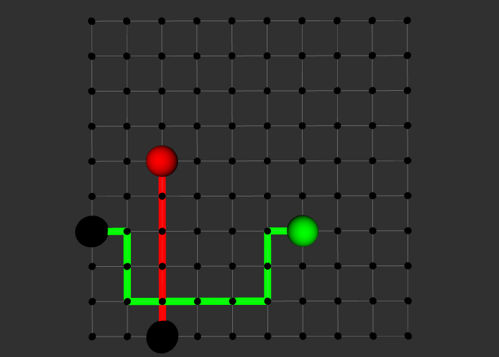
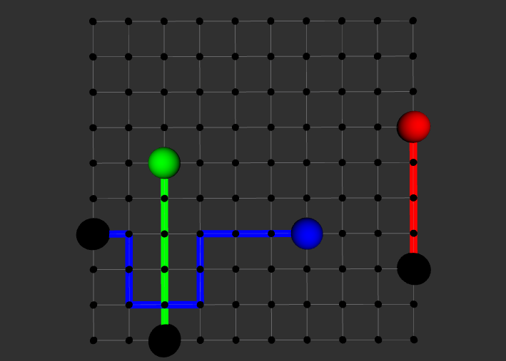
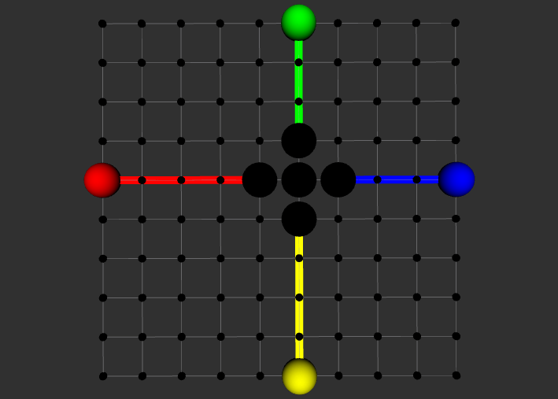

# Multi-agent planning with ROS and C++11
Adam Lee-Brown | adamleebrown94@gmail.com

---
## Summary
A single "planner" ROS node is responsible for planning paths for one or many "agents" from their start position to an end position within a 10x10 grid.

<b>Constraints stated in specifications:</b>
<li> All grid nodes are at a yaw angle of 0 degrees
<li> All grid edges are bi-directional and have a cost of 10
<li> Each grid node has zero cost 
<li> Each agent has a radius of 0.45m and omni-wheel drive (can strafe)
<li> Agent movement simulation not required
  
<b>Additional assumptions:</b>
<li> Agents all start at time t0 and cannot stop to wait at any point
<li> Theta values are ignored as each agent has omni-wheen drive

---
## Implementation sSummary
* The planner uses a bi-directional breadth-first search (BFS) algorithm to perform path planning. This involves performing BFS from an agent's start and end point simultaneously until the two searches intersect.
* The "roadmap" grid is stored as a 2D vector of Positions (x, y, theta). This allows for O(1) indexing, and coordinates are simply considered to be "connected" to neighboring coordinates above, below and to either side.
* The Planner updates each coordinate with an "occupiedTime", a time in seconds from t0 when an Agent will be centered on that coordinate. This is used for preventing collisions between multiple agents while allowing their paths to intersect.

---
## Operational example
* The <b>Planner</b> node is started. It instantiates the Roadmap (grid), a PathCache (to store computed paths), and subscribes to the "/agent_feedback" ROS topic and advertises the "/get_plan" ROS service.
  * The <b>Planner</b> also calls for the Roadmap to display the grid in rviz.
* An <b>Agent</b> node is created with an ID and a start position, which it publishes on the "/agent_feedback" ROS topic.
* The <b>Planner</b> creates an AgentPlan (a summary of an Agent for planning purposes) with that ID and start position and places it into an unordered hash map, keyed by the agent's ID.
* The <b>Agent</b> then receives a message on the "/update_goal" ROS service (see any .launch file in this repo to see its use), specifying an end goal for the Agent. The Agent then calls the "/get_plan" ROS service, providing the Planner with its end goal.
* The <b>Planner</b> then checks the PathCache for a path between the Agent's start and end position. If it exists within the cache, the Planner simply returns it. Otherwise, the Planner computes a path within the grid for that Agent, using bi-directional BFS, stores it in the cache, and sends it back to the Agent as the "/get_plan" service response.
  * The <b>Planner</b> also calls for the Roadmap to display the path in rviz.

---
## Install and build

<i>See http://wiki.ros.org/ROS/Tutorials/InstallingandConfiguringROSEnvironment for instructions on how to install and configure a ROS enviroment</i>
  
* Checkout this repository in {YOUR_CATKIN_WORKSPACE}/src/multi_agent_planning
* In {YOUR_CATKIN_WORKSPACE}, run "catkin_make"

---
## How to run
#### Launch files
In {YOUR_CATKIN_WORKSPACE}:
* "roslaunch multi_agent_planning base_case.launch"
  * This launches the case included in the task specifications: agent_1 moving from (2,0,0) (black) to (2,5,0) (red), and agent_2 moving from (0,3,0) (black) to (6,3,0) (green).

* "roslaunch multi_agent_planning start_position_collision.
  * As well as the two agents from base_case.launch, there are another two agents with identical start positions. Only one of those agents will have a computed path, and thus only three of the four paths will be displayed in rviz.

* "roslaunch multi_agent_planning no_possible_path.launch""no_possible_path")launch"
  * Five agents are created, one agent at (5,5,0), and the other four directly above, below and to either side. The agent at (5,5,0) has no possible path, as it is assumed that the agent can never "wait" at a position.

#### Tests
In {YOUR_CATKIN_WORKSPACE}:
* "rostest multi_agent_planning test.test"
  * This tests the case included in the task specifications: agent_1 moving from (2,0,0) to (2,5,0), and agent_2 moving from (0,3,0) to (6,3,0).

---

## Future work
Given additional time to work on this project, I would make the following improvements:
* Store the movement direction of each agent in the points within its path. This would allow one agent to follow another in the grid cell directly behind the other if they are both moving in the same direction. Currently, if agent A was at point (5,5) moving to point (6,5), and agent B was at (5,4), Agent B could not directly move to point (5,5) because the agents would collide given their 0.45m radius. However, if agent A was moving to point (5,6), Agent B could move to point (5,5) as they would be moving in the same direction and thus not collide.
* Additional input argument checking.
* Allow agents to be removed/re-defined.
  * Currently, if you start the Planner node and create an agent with ID "agent_1", that agent will not be removed and will occupy space on the grid until the Planner is terminated. This would also allow the PathCache to become useful.
* Make the grid 3D.
  * It should be a relatively simple process to convert the 10x10 2D grid to a 10x10x10 3D one. This would provide a base for exploring rudimentary air-traffic managment style collision-avoidance techniques.
* Simulate movement, and allow agents to be created at times after t0.
  * This would require more complex path planning by the Planner.